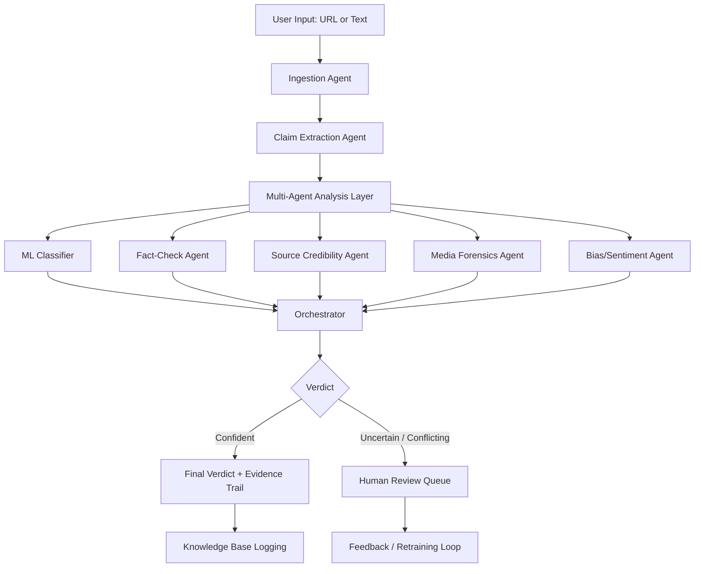
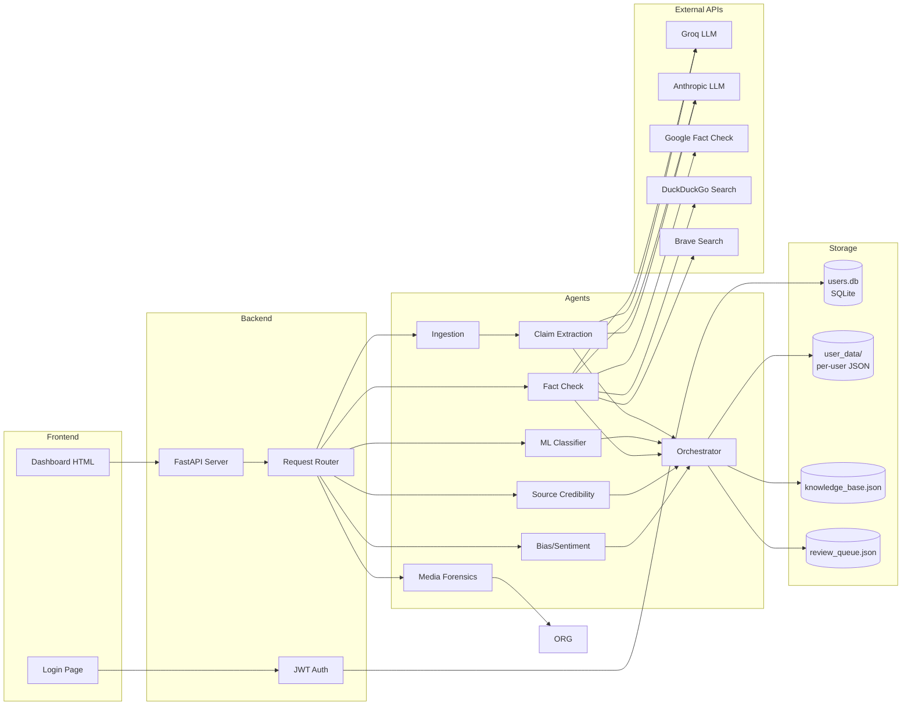
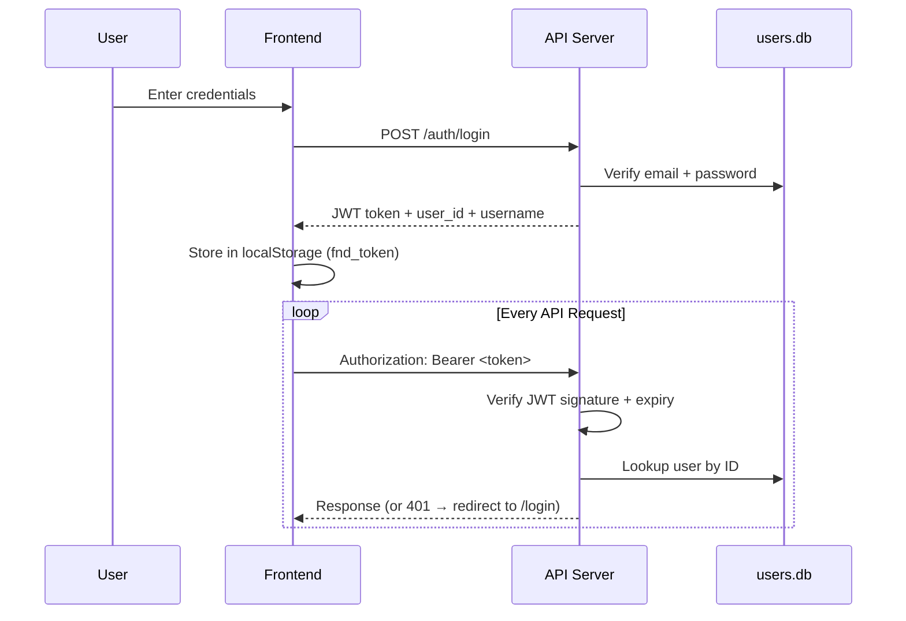
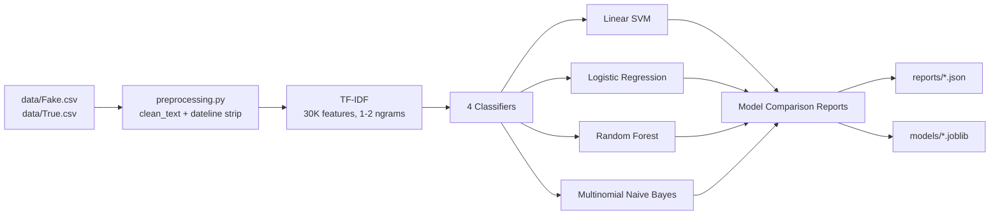
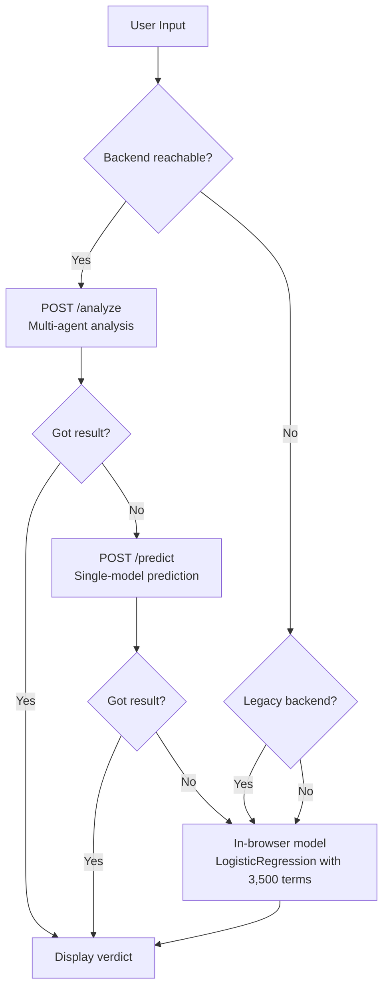

# AI-Powered Fake News Detection — Multi-Agent System

[](https://www.python.org/downloads/)
[](https://fastapi.tiangolo.com/)
[](#license)

A **layered multi-agent system** that goes beyond style-based classification to perform actual factual verification against live web sources. Built as a GenAI & Security portfolio project (Use Case #15).

---

## Table of Contents

- [Overview](#overview)
- [Architecture](#architecture)
- [Tech Stack](#tech-stack)
- [Project Structure](#project-structure)
- [Installation](#installation)
- [Environment Variables](#environment-variables)
- [Commands Reference](#commands-reference)
- [Quick Start](#quick-start)
- [API Reference](#api-reference)
- [Authentication System](#authentication-system)
- [Per-User Data Isolation](#per-user-data-isolation)
- [Multi-Agent System](#multi-agent-system)
- [ML Pipeline & Model Benchmarks](#ml-pipeline--model-benchmarks)
- [Dashboard](#dashboard)
- [Security](#security)
- [Database Documentation](#database-documentation)
- [Troubleshooting](#troubleshooting)
- [Limitations](#limitations)
- [Contributing](#contributing)
- [License & Credits](#license--credits)

---

## Overview

Most fake news detectors rely on **style-based ML classifiers** that learn writing patterns (e.g., sensationalist language, clickbait headlines). These are brittle — a bad actor who deliberately imitates wire-service formatting will bypass them.

This system takes a different approach: it **extracts factual claims** from an article, **verifies them against live web sources**, and combines that with domain reputation, media forensics, and bias analysis. The ML classifier is just one signal among many, not the sole decision-maker.

### What each agent does

| Agent | Input | Output | Why it matters |
|---|---|---|---|
| **Ingestion** | URL or raw text | Enriched article dict (body, metadata, images) | Provides richer input for all downstream agents |
| **Claim Extraction** | Cleaned article text | 2–5 checkable factual assertions | Enables verification instead of style-matching |
| **ML Classifier** | Cleaned article text | FAKE/REAL with confidence | Style signal as one input among several |
| **Fact-Check** | Extracted claims | FAKE/REAL/UNCERTAIN per claim | **The accuracy lever** — actual claim verification against external truth |
| **Source Credibility** | Domain + URL | Reputation score | Catches polished writing from known bad sources |
| **Media Forensics** | Article images | Manipulation signals | Catches reused/miscaptioned photos |
| **Bias/Sentiment** | Cleaned text | Loaded language score | Supporting signal for sensationalism |
| **Orchestrator** | All agent results | Final verdict + evidence trail | Weighs signals with override rules |

---

## Architecture

### System Flow

The system processes user-provided URLs or text through ingestion, claim extraction, parallel analysis agents, orchestration, and final verdict generation.



### Data Flow Diagram



### Agent Communication Pattern

Agents do **not** communicate with each other directly. They follow a **fan-out/fan-in** pattern:

1. **Fan-out**: The orchestrator dispatches the same enriched article dict to all agents in parallel
2. **Independent execution**: Each agent produces an `AgentResult` independently
3. **Fan-in**: The orchestrator collects all results and produces a single verdict

This design means:
- Adding a new agent requires zero changes to existing agents
- One agent failing does not crash the pipeline (graceful degradation)
- Each agent can be tested independently

---

## Tech Stack

### Backend

| Technology | Version | Purpose |
|---|---|---|
| **Python** | 3.10+ | Primary language |
| **FastAPI** | >= 0.110 | REST API framework |
| **Uvicorn** | >= 0.29 | ASGI server |
| **Pydantic** | >= 2.0 | Request/response validation |
| **SQLite** | 3.x | User authentication store |
| **httpx** | >= 0.27 | Async HTTP client (scraping, search, LLM calls) |
| **BeautifulSoup4** | >= 4.12 | HTML parsing |
| **OpenAI SDK** | >= 1.0 | LLM claim extraction |
| **Anthropic SDK** | >= 0.39 | LLM fallback |
| **python-jose** | >= 3.3 | JWT token handling |
| **bcrypt** | >= 4.0 | Password hashing |
| **python-multipart** | >= 0.0.6 | Form data parsing |
| **python-whois** | >= 0.9 | Domain age lookups |

### Machine Learning

| Technology | Version | Purpose |
|---|---|---|
| **scikit-learn** | >= 1.3 | TF-IDF, SVM, LogisticRegression, RandomForest, NaiveBayes |
| **pandas** | >= 2.0 | Data loading/manipulation |
| **numpy** | >= 1.24 | Numerical operations |
| **scipy** | >= 1.10 | Sparse matrices |
| **joblib** | >= 1.3 | Model serialization |
| **sentence-transformers** | >= 2.2 | Vector embeddings (optional, for RAG) |
| **faiss-cpu** | >= 1.7 | Vector similarity search (optional, for RAG) |

### Frontend

| Technology | Purpose |
|---|---|
| **Vanilla JavaScript** | No framework — pure JS |
| **Chart.js 4.4.4** | Bar charts (model benchmark) and line charts (trend) |
| **Google Fonts** | Space Grotesk, IBM Plex Mono, Newsreader |
| **localStorage** | JWT token persistence |
| **HTML5 / CSS3** | Dark-themed responsive UI |

### External APIs

| API | Purpose | Free Tier |
|---|---|---|
| **Groq** | Primary LLM (claim extraction + fact-check verdict) | Unknown |
| **Anthropic** | Fallback LLM | Unknown |
| **Google Fact Check Tools** | Claim verification | 100 queries/day |
| **DuckDuckGo** | Web search (Instant Answer + HTML scraping) | Free but fragile |
| **Brave Search** | Alternative web search | Depends on plan |
| **URLhaus (abuse.ch)** | Malware domain checking | Free |

---

## Project Structure

```
Fake-News-main/
├── api/                            FastAPI backend
│   ├── __init__.py                 Package marker
│   ├── main.py                     Routes, model loading, /analyze, /predict
│   ├── auth.py                     JWT auth, bcrypt, OAuth2 router
│   ├── schemas.py                  Pydantic request/response models
│   └── user_db.py                  Per-user SQLite + JSON isolation
│
├── agents/                         Multi-agent system (8 agents)
│   ├── __init__.py                 Package exports
│   ├── base.py                     BaseAgent, AgentResult, Label enum
│   ├── ingestion.py                URL scraping, metadata extraction, domain detection
│   ├── claim_extraction.py         LLM-based claim extraction + rule-based fallback
│   ├── ml_classifier.py            TF-IDF + Linear SVM wrapper
│   ├── fact_check.py               Web search + fact-check APIs + LLM verdict
│   ├── source_credibility.py       Domain reputation, WHOIS, URLhaus
│   ├── media_forensics.py          EXIF, perceptual hashing (images only)
│   ├── bias_sentiment.py           Loaded language, emotional patterns
│   ├── orchestrator.py             Weighted voting + override rules
│   ├── knowledge_base.py           Vector DB / RAG (FAISS + sentence-transformers)
│   ├── review_queue.py             Human review routing
│   └── feedback.py                 Retraining data feedback loop
│
├── src/                            ML training pipeline
│   ├── preprocessing.py            Text cleaning, stopwords, dateline stripping
│   ├── train.py                    Train 4 classifiers, export reports
│   ├── ablation_dateline.py        Source-leakage experiment
│   ├── export_js_model.py          Compact client-side model for dashboard
│   └── build_dashboard.py          Rebuilds dashboard HTML from reports
│
├── dashboard/                      Analyst UI
│   ├── login.html                  Login/register page
│   ├── auth.js                     Frontend auth module (JWT in localStorage)
│   ├── template.html               Dashboard template with __EMBEDDED_DATA__
│   └── index.html                  Generated dashboard (156 KB, data baked in)
│
├── data/                           Datasets and state
│   ├── Fake.csv                    Fake news articles (~23,481)
│   ├── True.csv                    Real news articles (~21,417)
│   ├── knowledge_base.json         Global vector DB entries (28 claims)
│   ├── review_queue.json           Global review queue (16 entries)
│   ├── users.db                    SQLite users table
│   ├── user_data/                  Per-user isolated data
│   │   └── {user_id}/             One directory per registered user
│   │       ├── analysis_results.json
│   │       ├── feedback_log.json
│   │       ├── knowledge_base.json
│   │       ├── review_queue.json
│   │       └── settings.json
│   └── README.md                   Dataset download instructions
│
├── models/                         Trained model artifacts
│   ├── best_model.joblib           Production model (Linear SVM, ~722 KB)
│   ├── vectorizer.joblib           Fitted TF-IDF vectorizer (~1.2 MB)
│   └── best_model_name.txt         "Linear SVM"
│
├── reports/                        JSON metrics
│   ├── model_comparison.json       Accuracy/F1 per model
│   ├── confusion_matrices.json     Confusion matrix per model
│   ├── category_breakdown.json     Accuracy by subject tag
│   ├── trend_data.json             Monthly fake/real volume
│   ├── dateline_leakage_ablation.json  With/without dateline comparison
│   └── js_model.json               Compact client-side model (3,500 terms)
│
├── docs/
│   └── limitations.md              Limitations & responsible-use note
│
├── .env                            Environment config (git-ignored)
├── .env.example                    Environment template
├── .gitignore                      Git ignore rules
├── requirements.txt                Python dependencies
└── README.md                       This file
```

---

## Installation

### Prerequisites

- **Python 3.10+** (3.11 or 3.12 recommended)
- **pip** (Python package manager)
- **Git** (for cloning)

### Step-by-step

```bash
# 1. Clone the repository
git clone https://github.com/your-username/Fake-News-main.git
cd Fake-News-main/Fake-News-main

# 2. Create a virtual environment (recommended)
python -m venv myenv

# Activate it:
# Windows (PowerShell):
myenv\Scripts\Activate.ps1
# Windows (cmd):
myenv\Scripts\activate.bat
# macOS/Linux:
source myenv/bin/activate

# 3. Install dependencies
pip install -r requirements.txt

# 4. Optional: install media forensics dependencies
pip install Pillow ImageHash

# 5. Optional: install knowledge base vector search (heavy, ~200MB+)
pip install sentence-transformers faiss-cpu

# 6. Download the dataset
# Download from: https://www.kaggle.com/clmentbisaillon/fake-and-real-news-dataset
# Place Fake.csv and True.csv in the data/ directory

# 7. Set up environment variables
cp .env.example .env
# Edit .env with your API keys

# 8. Train the models (optional — pre-trained models are included)
python src/train.py
python src/ablation_dateline.py
python src/export_js_model.py
python src/build_dashboard.py
```

### Dependency Tiers

| Tier | Packages | Purpose |
|---|---|---|
| **Core (required)** | fastapi, uvicorn, pydantic, scikit-learn, pandas, numpy, joblib, httpx, beautifulsoup4, openai, anthropic, python-whois, python-jose, bcrypt, python-multipart | All backend + ML functionality |
| **Media (optional)** | Pillow, ImageHash | EXIF extraction, perceptual hashing |
| **RAG (optional)** | sentence-transformers, faiss-cpu | Vector search for knowledge base |

> **Without optional dependencies**: The system degrades gracefully. Media forensics is skipped when images aren't present. The knowledge base falls back to keyword search.

> **Note**: All packages (including optional) are listed in `requirements.txt`. To install only the core tier without optional heavy dependencies, install packages individually or use `pip install --no-deps` and manage dependencies manually.

---

## Environment Variables

Create a `.env` file in the project root (copy from `.env.example`):

| Variable | Required | Default | Description |
|---|---|---|---|
| `SECRET_KEY` | No | `"dev-secret-change-in-production-please"` | JWT signing secret (change in production!) |
| `TOKEN_EXPIRE_MINUTES` | No | `1440` | JWT token lifetime in minutes (24h) |
| `FACTCHECK_API_KEY` | No | `None` | Google Fact Check Tools API key (free: 100/day) |
| `OPENAI_API_KEY` | No | `None` | OpenAI API key for LLM claim extraction |
| `OPENAI_BASE_URL` | No | `None` | Custom OpenAI-compatible base URL |
| `GROQ_API_KEY` | No | `None` | Groq API key (fast/cheap LLM, primary for fact-check) |
| `ANTHROPIC_API_KEY` | No | `None` | Anthropic API key (fallback LLM) |
| `BRAVE_API_KEY` | No | `None` | Brave Search API key (alternative to DuckDuckGo) |

> **Without API keys**: The system still works. Claim extraction falls back to rule-based patterns. Fact-check falls back to direct LLM verification (if LLM keys available) or returns UNCERTAIN.

### Default LLM Model Configuration

The fact-check agent (`agents/fact_check.py`) uses these defaults:

```python
# Primary LLM (Groq)
GROQ_MODEL = "openai/gpt-oss-120b"

# Fallback LLM (Anthropic)
ANTHROPIC_MODEL = "claude-sonnet-4-6"
```

---

## Commands Reference

### Running the Server

```bash
# Development (with auto-reload)
uvicorn api.main:app --reload --port 8000

# Production
uvicorn api.main:app --host 0.0.0.0 --port 8000
```

### Training Pipeline

All commands must be run from the **project root** (where this README lives).

```bash
# Train all 4 classifiers (requires data/Fake.csv + data/True.csv)
python src/train.py

# Run dateline leakage ablation experiment
python src/ablation_dateline.py

# Export compact client-side model for dashboard
python src/export_js_model.py

# Rebuild dashboard HTML with latest numbers
python src/build_dashboard.py

# Full rebuild (all 4 steps above)
python src/train.py && python src/ablation_dateline.py && python src/export_js_model.py && python src/build_dashboard.py
```

### API Interaction

```bash
# Health check (requires JWT token)
curl http://127.0.0.1:8000/health -H "Authorization: Bearer YOUR_JWT_TOKEN"

# Register a new user
curl -X POST http://127.0.0.1:8000/auth/register \
  -H "Content-Type: application/json" \
  -d '{"username": "analyst1", "email": "analyst@example.com", "password": "securepass123"}'

# Login and get JWT token
curl -X POST http://127.0.0.1:8000/auth/login \
  -H "Content-Type: application/x-www-form-urlencoded" \
  -d "username=analyst@example.com&password=securepass123"

# Multi-agent analysis (with JWT token)
curl -X POST http://127.0.0.1:8000/analyze \
  -H "Content-Type: application/json" \
  -H "Authorization: Bearer YOUR_JWT_TOKEN" \
  -d '{"title": "Fed holds interest rates steady", "text": "The Federal Reserve said on Wednesday it would keep interest rates unchanged..."}'

# Legacy single-model prediction (with JWT token)
curl -X POST http://127.0.0.1:8000/predict \
  -H "Content-Type: application/json" \
  -H "Authorization: Bearer YOUR_JWT_TOKEN" \
  -d '{"title": "Fed holds interest rates steady", "text": "The Federal Reserve said..."}'
```

---

## Quick Start

```bash
# 1. Install
pip install -r requirements.txt

# 2. Start server
uvicorn api.main:app --reload --port 8000

# 3. Open in browser
# Dashboard: http://127.0.0.1:8000/
# Login:     http://127.0.0.1:8000/login
# API docs:  http://127.0.0.1:8000/docs
```

---

## API Reference

All endpoints require JWT authentication unless marked **Public**.

### Authentication Endpoints

| Method | Path | Auth | Description |
|---|---|---|---|
| `POST` | `/auth/register` | Public | Register new user |
| `POST` | `/auth/login` | Public | Login, returns JWT token |
| `GET` | `/auth/me` | Required | Get current user info |
| `POST` | `/auth/logout` | Public | Client-side logout (discard token) |

#### `POST /auth/register`

**Request Body:**
```json
{
  "username": "analyst1",
  "email": "analyst@example.com",
  "password": "securepass123"
}
```

**Response (200):**
```json
{
  "id": 1,
  "username": "analyst1",
  "email": "analyst@example.com"
}
```

**Errors:**
- `400`: Username or email already registered
- `422`: Validation error (e.g., password < 6 chars)

#### `POST /auth/login`

**Request Body (form-data):**
```
username=analyst@example.com&password=securepass123
```

**Response (200):**
```json
{
  "access_token": "eyJ0eXAiOiJKV1QiLCJhbGciOiJIUzI1NiJ9...",
  "token_type": "bearer",
  "user_id": 1,
  "username": "analyst1"
}
```

**Errors:**
- `401`: Invalid email or password

### Core Endpoints

| Method | Path | Auth | Description |
|---|---|---|---|
| `GET` | `/` | Public | Serves dashboard (client-side auth check) |
| `GET` | `/login` | Public | Serves login page |
| `GET` | `/dashboard` | Public | Alias for `/` |
| `GET` | `/health` | Required | Liveness check + agent status |
| `POST` | `/analyze` | Required | **Multi-agent analysis with evidence trail** |
| `POST` | `/predict` | Required | Legacy single-model prediction |

#### `POST /analyze` — Main Endpoint

**Request Body:**
```json
{
  "title": "Article title (optional)",
  "text": "Article text to analyze",
  "url": "https://example.com/article (optional — if provided, scrapes content)"
}
```

**Response (200):**
```json
{
  "label": "fake",
  "confidence": 0.87,
  "reasoning": "Fact-check found 3 claims contradicted by web sources...",
  "agent_results": [
    {"agent_name": "ml_classifier", "label": "real", "confidence": 0.72, "reasoning": "...", "evidence": [], "elapsed_ms": 45},
    {"agent_name": "fact_check", "label": "fake", "confidence": 0.91, "reasoning": "...", "evidence": [], "elapsed_ms": 3200},
    {"agent_name": "source_credibility", "label": "fake", "confidence": 0.65, "reasoning": "...", "evidence": [], "elapsed_ms": 890},
    {"agent_name": "media_forensics", "label": "uncertain", "confidence": 0.0, "reasoning": "...", "evidence": [], "elapsed_ms": 0},
    {"agent_name": "bias_sentiment", "label": "fake", "confidence": 0.58, "reasoning": "...", "evidence": [], "elapsed_ms": 12}
  ],
  "evidence_trail": [
    {"claim": "Interest rates unchanged", "verdict": "supported", "sources": ["federalreserve.gov"]}
  ],
  "needs_human_review": false,
  "review_reason": "",
  "elapsed_ms": 4150
}
```

**Agent execution logic:**
- `ml_classifier` — always runs
- `fact_check` — always runs
- `source_credibility` — runs only if URL or domain detected in text
- `media_forensics` — runs only if images are present
- `bias_sentiment` — always runs

#### `POST /predict` — Legacy Endpoint

**Request Body:**
```json
{
  "title": "Article title (optional)",
  "text": "Article text to classify"
}
```

**Response (200):**
```json
{
  "label": "fake",
  "confidence": 0.93,
  "fake_probability": 0.93,
  "real_probability": 0.07,
  "model_used": "Linear SVM"
}
```

### Review Queue Endpoints

| Method | Path | Auth | Description |
|---|---|---|---|
| `GET` | `/review-queue` | Required | Review queue statistics |
| `GET` | `/review-queue/pending` | Required | List pending review items |
| `POST` | `/review/{entry_id}/resolve` | Required | Resolve review with human verdict |

#### `POST /review/{entry_id}/resolve`

**Request Body:**
```json
{
  "human_verdict": "fake",
  "notes": "Confirmed false — Reuters fact-check contradicts"
}
```

### Feedback Endpoints

| Method | Path | Auth | Description |
|---|---|---|---|
| `POST` | `/feedback` | Required | Log a corrected verdict |
| `GET` | `/knowledge-base/stats` | Required | Knowledge base statistics |

#### `POST /feedback`

**Request Body:**
```json
{
  "article_text": "The full text of the article...",
  "corrected_verdict": "real",
  "original_verdict": "fake"
}
```

### Statistics Endpoints

| Method | Path | Auth | Description |
|---|---|---|---|
| `GET` | `/stats/model-comparison` | Required | Accuracy/F1 per model |
| `GET` | `/stats/confusion-matrix` | Required | Confusion matrix for Linear SVM |
| `GET` | `/stats/category-breakdown` | Required | Accuracy by article subject |
| `GET` | `/stats/trend` | Required | Monthly fake/real volume |
| `GET` | `/limitations` | Required | Limitations & responsible-use note |

---

## Authentication System

### JWT Flow



### Token Details

| Property | Value |
|---|---|
| Algorithm | HS256 |
| Secret source | `SECRET_KEY` env var |
| Expiry | 24 hours (configurable via `TOKEN_EXPIRE_MINUTES`) |
| Payload | `{"sub": user_id, "exp": expiry_timestamp}` |

### Password Hashing

- **Algorithm**: bcrypt with salt (12 rounds)
- **Implementation**: direct `bcrypt` library (no passlib dependency)
- **Minimum length**: 6 characters

### Frontend Auth Integration

The frontend (`dashboard/auth.js`) uses a global `fetch` interceptor:

1. **On page load**: `requireAuth()` checks if a valid token exists. If not, redirects to `/login`.
2. **On every request**: `fetchWithAuth()` automatically attaches `Authorization: Bearer <token>` to all `fetch()` calls.
3. **On 401 response**: clears the token and redirects to `/login`.
4. **On sign-out**: clears `localStorage` and reloads the page.

---

## Per-User Data Isolation

### Architecture

```
data/
├── users.db                    Shared: SQLite table for credentials
│                               Columns: id, username, email, hashed_password, is_active, created_at
│
└── user_data/
    ├── 1/                      User ID 1's isolated storage
    │   ├── analysis_results.json
    │   ├── feedback_log.json
    │   ├── knowledge_base.json
    │   ├── review_queue.json
    │   └── settings.json
    │
    └── 2/                      User ID 2's isolated storage
        ├── analysis_results.json
        ├── feedback_log.json
        ├── knowledge_base.json
        ├── review_queue.json
        └── settings.json
```

### How It Works

1. **Registration**: `create_user()` inserts into SQLite, then creates `data/user_data/{user_id}/` with empty JSON files
2. **All data operations** require a `user_id` parameter and read/write to that user's directory only
3. **API layer**: extracts `user["id"]` from the JWT token and passes it to every data operation
4. **No cross-user leakage**: each function (`add_to_review_queue()`, `get_user_kb_entries()`, etc.) is scoped to one user's directory

### Gitignore

The `.gitignore` excludes both shared and per-user data:
```
data/user_data/
data/users.db
```

---

## Multi-Agent System

### Agent Hierarchy

```
BaseAgent (abstract)
├── IngestionAgent
├── ClaimExtractionAgent
├── MLClassifierAgent
├── FactCheckAgent
├── SourceCredibilityAgent
├── MediaForensicsAgent
├── BiasSentimentAgent
├── OrchestratorAgent
├── KnowledgeBase
├── ReviewQueue
└── FeedbackLoop
```

### BaseAgent Pattern

Every agent inherits from `BaseAgent` which provides:

- **Timing**: wraps `run()` with `time.perf_counter()` measurement
- **Exception handling**: catches all exceptions, returns `UNCERTAIN` with confidence 0.0
- **Standardized output**: always returns an `AgentResult` dataclass

```python
@dataclass
class AgentResult:
    agent_name: str
    label: Label              # FAKE, REAL, or UNCERTAIN
    confidence: float         # 0.0 to 1.0
    reasoning: str            # Human-readable explanation
    evidence: list[dict]      # Supporting evidence items
    raw_output: dict          # Agent-specific raw data
    elapsed_ms: int           # Execution time in milliseconds
```

### Individual Agent Details

#### Ingestion Agent (`agents/ingestion.py`)

**Purpose**: Scrape URLs, extract metadata, build enriched article dict.

- Fetches URL with httpx (10s timeout, custom User-Agent)
- Extracts article body from `<article>`, `div.article-body`, `div.post-content`, etc.
- Pulls OpenGraph/Twitter meta tags (og:title, og:description, og:image, author, published_time)
- Extracts images (skips <50px icons, caps at 20)
- Detects news domains from text using regex + `KNOWN_NEWS_DOMAINS` set (28 domains)
- Returns `UNCERTAIN` (ingestion never judges)

#### Claim Extraction Agent (`agents/claim_extraction.py`)

**Purpose**: Extract checkable factual claims from article text.

- **Primary**: Uses OpenAI-compatible LLM (default: `gpt-4o-mini`)
- **Fallback**: Rule-based extraction using regex patterns for:
  - Statistics (`\d+\s*(%|percent|million|billion)`)
  - Attributions (`"said|according to|announced"`)
  - Dates (`\b\d{4}\b`)
  - Approximate numbers (`"thousands of|hundreds of"`)
- Returns `UNCERTAIN` (extraction doesn't judge)

#### ML Classifier Agent (`agents/ml_classifier.py`)

**Purpose**: Style-based classification using TF-IDF + Linear SVM.

- Lazy-loads `models/best_model.joblib` and `models/vectorizer.joblib` on first call
- Uses `src/preprocessing.clean_text()` with `remove_dateline=True`
- Returns probabilities via `predict_proba()` (Linear SVM wrapped with `CalibratedClassifierCV`)
- **Weight in orchestrator**: 0.15

#### Fact-Check Agent (`agents/fact_check.py`) — Most Complex

**Purpose**: Verify claims against live web sources. This is the accuracy lever.

**LLM Provider Chain:**
1. Groq (primary, fast) — `openai/gpt-oss-120b` via `https://api.groq.com/openai/v1/chat/completions`
2. Anthropic (fallback) — `claude-sonnet-4-6` via native SDK
3. Both return `None` if unavailable

**For each claim (up to 5, 10+ chars each):**
1. **Query Generation**: LLM generates 3 targeted search queries per claim
2. **Phase 1 — Evidence Retrieval** (parallel via `ThreadPoolExecutor`):
   - Google Fact Check Tools API
   - DuckDuckGo Instant Answer API (JSON)
   - DuckDuckGo HTML search (fallback)
   - Brave Search API (if `BRAVE_API_KEY` set)
3. **Phase 2 — LLM Verdict Analysis**: If evidence found, LLM analyzes claim vs evidence
4. **Phase 3 — Direct LLM Verification**: If no search results, LLM directly judges TRUE/FALSE/UNCERTAIN

**Aggregation:**
- Counts supported/contradicted/mixed across all claims
- Label: FAKE if contradicted > supported, REAL if supported > contradicted
- Confidence: composite of average claim confidence + evidence coverage ratio

**Weight in orchestrator**: 0.40 (highest — most reliable signal)

#### Source Credibility Agent (`agents/source_credibility.py`)

**Purpose**: Evaluate domain reputation.

- Checks against `KNOWN_LOW_CREDIBILITY` (16 domains: infowars.com, naturalnews.com, etc.)
- Checks against `KNOWN_HIGH_CREDIBILITY` (28 domains: reuters.com, apnews.com, etc.)
- WHOIS lookup: domain age (< 90 days = penalty, > 3650 days = bonus)
- URLhaus API: checks if domain is flagged for malware hosting
- TLD heuristics: suspicious TLDs (.xyz, .top, .club, .info, .buzz, .gq, .ml, .cf, .tk) get penalty
- Score starts at 0.5, adjusted by each check
- **Weight in orchestrator**: 0.15

#### Media Forensics Agent (`agents/media_forensics.py`)

**Purpose**: Detect image manipulation and reuse.

- Downloads images via httpx (skips > 10MB)
- EXIF extraction: camera make/model, software, GPS presence, original date
- Flags: GPS data present, editing software detected (Photoshop, Gimp, etc.)
- Perceptual hashing: `imagehash.phash()` for duplicate detection
- Reverse image search: **STUB** — `_reverse_image_search()` returns `[]`
- Skipped entirely when no images present
- **Weight in orchestrator**: 0.10

#### Bias/Sentiment Agent (`agents/bias_sentiment.py`)

**Purpose**: Detect loaded language and sensationalism.

- `STRONG_BIAS_WORDS` (42 terms): "shocking", "unbelievable", "conspiracy", "sheeple", "hoax", etc.
- `MODERATE_BIAS_WORDS` (21 terms): "allegedly", "reportedly", "controversial", etc.
- `EMOTIONAL_PATTERNS` (6 regex): ALL CAPS, excessive exclamation, fear-mongering, etc.
- `HEADCLINE_PATTERNS` (3 regex): death counts, all-caps action verbs, etc.
- Composite score 0-1 based on weighted sum
- **Weight in orchestrator**: 0.05 (supporting signal only)

#### Orchestrator (`agents/orchestrator.py`)

**Purpose**: Combine all agent outputs into a single verdict.

**Agent Weights:**

| Agent | Weight | Rationale |
|---|---|---|
| `claim_extraction` | 0.0 | Extraction only, no classification |
| `ml_classifier` | 0.15 | Style signal (useful but not ground truth) |
| `fact_check` | 0.40 | **THE accuracy lever** — actual claim verification |
| `source_credibility` | 0.15 | Domain reputation catches known bad actors |
| `media_forensics` | 0.10 | Image manipulation detection |
| `bias_sentiment` | 0.05 | Supporting signal only |
| `ingestion` | 0.0 | No classification |

**Decision Logic:**

```
weighted_fake = sum(weight_i * confidence_i) for all agents labeling "fake"
weighted_real = sum(weight_i * confidence_i) for all agents labeling "real"

if fact_check.confidence > 0.7 and fact_check.label != ml_classifier.label:
    → fact_check wins (override #1)
elif source_credibility.confidence > 0.6 and source_credibility.label == "fake" and ml_classifier.label == "real":
    → source_credibility wins (override #2)
else:
    → fake_ratio = weighted_fake / total_weight
    → real_ratio = weighted_real / total_weight
    → label = argmax(fake_ratio, real_ratio)
    → confidence = max(fake_ratio, real_ratio)
```

**Override Rules:**
1. **Fact-check override**: If fact-check is highly confident (>0.7) and contradicts the ML classifier, fact-check wins. This prevents a style-based classifier from overriding actual factual evidence.
2. **Source credibility override**: Known bad domains with low credibility scores override the ML classifier.
3. **Human review routing**: Low-confidence or conflicting cases go to a review queue.

**Human Review Triggers:**
- Confidence < 0.5
- Override applied (agent conflict)
- Weighted vote difference < 0.1 (agents strongly disagree)

---

## ML Pipeline & Model Benchmarks

### Training Pipeline



### Text Preprocessing (`src/preprocessing.py`)

1. Strip Reuters dateline (e.g., "WASHINGTON (Reuters) -")
2. Remove URLs
3. Lowercase
4. Remove non-alphabetic characters
5. Collapse whitespace
6. Remove standalone "reuters" mentions (when `remove_dateline=True`)

> **Note**: Stopwords are not removed by `clean_text()`. They are passed as the `stop_words` parameter to `TfidfVectorizer` in `train.py` and applied only at vectorization time. The stopwords set is entirely hand-maintained (no NLTK runtime dependency).

### TF-IDF Configuration

| Parameter | Value |
|---|---|
| Max features | 30,000 |
| N-grams | (1, 2) |
| Min document frequency | 5 |
| Sublinear TF | True |
| Custom stopwords | Yes (combined common + news-specific) |

### Model Performance

All models use identical TF-IDF features and the same 8,978-article held-out test set (80/20 stratified split from 44,889 total articles).

| Model | Accuracy | F1 (weighted) | F1 (macro) | Inference Time |
|---|---|---|---|---|
| **Linear SVM** | **0.9937** | **0.9937** | **0.9936** | 0.016s |
| Random Forest | 0.9893 | 0.9893 | 0.9893 | 1.433s |
| Logistic Regression | 0.9881 | 0.9881 | 0.9881 | 0.005s |
| Multinomial Naive Bayes | 0.9581 | 0.9581 | 0.9580 | 0.008s |

### Confusion Matrix (Linear SVM)

|  | Predicted fake | Predicted real |
|---|---|---|
| **Actual fake** | 4,665 | 30 |
| **Actual real** | 27 | 4,256 |

### Dateline Leakage Ablation

| Setting | Accuracy | F1 |
|---|---|---|
| Dateline left in | ~99.5% | ~99.5% |
| Dateline stripped (production) | 99.37% | 99.37% |

Leaving the Reuters wire dateline in inflates accuracy by letting the model key on formatting rather than content. The production pipeline strips it; the residual accuracy is attributable to actual linguistic/stylistic signal.

### Client-Side Model (`src/export_js_model.py`)

A compact LogisticRegression with 3,500 unigram features exported as JSON for in-browser fallback:

```json
{
  "intercept": 1.23,
  "terms": {"word": [idf_value, coefficient], ...},
  "meta": {"n_features": 3500, "model": "LogisticRegression"}
}
```

---

## Dashboard

### Three-File Design

| File | Size | Description |
|---|---|---|
| `dashboard/template.html` | 35 KB | Template with `__EMBEDDED_DATA__` placeholder |
| `dashboard/index.html` | 156 KB | Generated dashboard (data baked in) |
| `dashboard/login.html` | 8.5 KB | Standalone login/register page |
| `dashboard/auth.js` | 4.8 KB | Frontend auth module |

### Dashboard Features

- **Live Desk**: Paste article text or URL, runs multi-agent analysis via `/analyze`, falls back to `/predict`, then falls back to in-browser model
- **Model Bench**: Chart.js bar chart comparing all 4 classifiers
- **Confusion Matrix**: 2x2 grid for Linear SVM production model
- **Category Breakdown**: Per-subject accuracy bars
- **Trend Chart**: Monthly fake vs. real volume (Chart.js line)
- **Editor's Note**: Ablation table + limitations disclaimer
- **Agent Breakdown Grid**: Shows each specialist agent's label/confidence
- **Evidence Trail**: Orchestrator reasoning chain
- **Human Review Badge**: Shown when routed to review queue

### 3-Tier Fallback Chain



### Backend Health Probe

On page load, the dashboard hits `/health` with a 2.5s timeout:
- If reachable: shows connection status and version in the ticker
- If unreachable: displays "Backend not reachable — using in-browser backup model"

### Rebuilding the Dashboard

```bash
python src/train.py               # trains + evaluates all 4 models
python src/ablation_dateline.py    # reproduces the leakage-ablation numbers
python src/export_js_model.py      # regenerates the compact client-side model
python src/build_dashboard.py      # rebuilds dashboard with new numbers
```

---

## Security

### Implemented

| Measure | Implementation |
|---|---|
| JWT authentication | Stateless tokens with configurable expiry (24h default) |
| Password hashing | bcrypt with salt (12 rounds) |
| Per-user data isolation | Separate JSON files per user_id |
| Parameterized SQL | SQLite with `?` placeholders (no SQL injection) |
| CORS | Configured (currently `allow_origins=["*"]` for dev) |
| `.env` excluded from git | `.gitignore` covers `.env`, `data/users.db`, `data/user_data/` |
| XSS protection | `escapeHtml()` function in dashboard JS |
| Token-based auth | Bearer tokens in headers (not cookies, so no CSRF risk) |

### Security Considerations

| Concern | Status | Notes |
|---|---|---|
| **Rate limiting** | Not implemented | Login has no brute-force protection |
| **HTTPS** | Not enforced | No TLS termination — use a reverse proxy in production |
| **Token revocation** | Client-side only | Logout discards the token; no server-side blacklist |
| **CORS `*`** | Open | Acceptable for dev, restrict in production |
| **Default JWT secret** | Hardcoded fallback | Change `SECRET_KEY` env var before deploying |
| **Sequential user IDs** | Predictable (1, 2, 3) | Not a vulnerability with JWT auth |
| **API key in source** | Hardcoded fallback in `fact_check.py` | Use env vars; never commit real keys |
| **DuckDuckGo scraping** | Fragile | Could be rate-limited or blocked |
| **No input sanitization** | Not needed for SQL | XSS handled by frontend `escapeHtml()` |

### Production Recommendations

1. Set `SECRET_KEY` to a cryptographically random string
2. Replace `allow_origins=["*"]` with your frontend domain
3. Add rate limiting (e.g., `slowapi` or nginx rate limiting)
4. Put behind a reverse proxy (nginx/Caddy) with TLS
5. Add password complexity requirements (uppercase, numbers, special chars)
6. Implement server-side token blacklisting for logout

---

## Database Documentation

### SQLite Schema (`data/users.db`)

```sql
CREATE TABLE users (
    id INTEGER PRIMARY KEY AUTOINCREMENT,
    username TEXT NOT NULL UNIQUE,
    email TEXT NOT NULL UNIQUE,
    hashed_password TEXT NOT NULL,
    is_active REAL DEFAULT 1,
    created_at REAL DEFAULT (strftime('%s','now'))
);
```

### JSON Data Files (per-user)

Each user gets these files in `data/user_data/{user_id}/`:

#### `analysis_results.json`
```json
[]
```
Stores all analysis results for the user's articles.

#### `feedback_log.json`
```json
[]
```
Stores human corrections and feedback for retraining.

#### `knowledge_base.json`
```json
[
  {
    "id": "kb_123",
    "claim": "Interest rates unchanged",
    "label": "real",
    "confidence": 0.89,
    "sources": ["federalreserve.gov"],
    "timestamp": "2026-08-20T10:00:00"
  }
]
```
Vector DB entries for RAG-based fact verification.

#### `review_queue.json`
```json
[
  {
    "id": "rev_456",
    "article_text": "...",
    "label": "uncertain",
    "confidence": 0.35,
    "reason": "Agents strongly disagree",
    "status": "pending",
    "created_at": "2026-08-20T10:00:00"
  }
]
```
Human review routing for low-confidence cases.

#### `settings.json`
```json
{}
```
User preferences (currently empty placeholder).

---

## Troubleshooting

### Common Issues

| Issue | Cause | Solution |
|---|---|---|
| `ModuleNotFoundError: No module named 'api'` | Running from wrong directory | Run from project root (where README is) |
| `FileNotFoundError: models/best_model.joblib` | Model not trained | Run `python src/train.py` first |
| `FileNotFoundError: data/Fake.csv` | Dataset not downloaded | Download from Kaggle and place in `data/` |
| `401 Unauthorized` on all endpoints | Token expired or missing | Login again at `/login` |
| `503 Service Unavailable` on `/analyze` | LLM API keys not configured | Set `GROQ_API_KEY` or `OPENAI_API_KEY` |
| Very slow first analysis | Bootstrap loads sentence-transformers | Normal for first request; subsequent requests are fast |
| `ImportError: No module named 'sentence_transformers'` | Optional dependency missing | Run `pip install sentence-transformers faiss-cpu` or ignore (degrades gracefully) |
| `bcrypt` version error | bcrypt/passlib incompatibility | Use `bcrypt>=4.0` directly (passlib not needed) |
| Dashboard shows "Backend not reachable" | Server not running | Start with `uvicorn api.main:app --reload --port 8000` |
| `AttributeError: 'NoneType'` in fact-check | LLM API key missing | Set `GROQ_API_KEY` or `ANTHROPIC_API_KEY` |

### Verbose Logging

Enable Python logging for debugging:

```bash
# Set log level before starting
set LOG_LEVEL=DEBUG
uvicorn api.main:app --reload --port 8000 --log-level debug
```

### Performance Notes

| Operation | Typical Latency |
|---|---|
| ML classification only | 16ms |
| Full multi-agent analysis | 3–5 seconds |
| First analysis (model bootstrap) | 10–30 seconds |
| LLM claim extraction | 1–2 seconds |
| Web search (per claim) | 500ms–1.5 seconds |

---

## Limitations

See `docs/limitations.md` for the full list. Key points:

1. **Narrow dataset**: Real articles are Reuters wire copy; fake articles are from a small set of flagged outlets. The ML classifier has not seen sports, entertainment, science, health, or local-news writing.
2. **Style mimicry**: A bad actor who deliberately imitates wire-service formatting will erode the ML classifier's accuracy — but fact-check and source credibility agents provide independent signals.
3. **Fact-check agent**: Requires internet access and API keys. The free tier is limited to 100 queries/day.
4. **Media forensics**: Reverse image search is currently a stub. Cannot detect deepfakes or AI-generated images.
5. **Source credibility list**: The `KNOWN_LOW_CREDIBILITY` list reflects editorial judgment based on fact-check records, not a neutral classification.
6. **DuckDuckGo scraping**: Fragile; may be rate-limited or blocked. Brave Search is the preferred alternative.
7. **No real-time streaming**: Results are returned after all agents complete; no WebSocket streaming of intermediate results.
8. **Single-user training data**: The ML model was trained on English-language articles only.

### Recommended Use

Treat predictions as a **triage signal for human fact-checkers**, not an automated takedown mechanism. The system is designed to accelerate human review, not replace it.

---

## Contributing

### Development Setup

```bash
# Clone and install
git clone https://github.com/your-username/Fake-News-main.git
cd Fake-News-main/Fake-News-main
python -m venv myenv
myenv\Scripts\activate  # Windows
pip install -r requirements.txt

# Start with auto-reload
uvicorn api.main:app --reload --port 8000
```

### Code Conventions

- **Python**: snake_case for functions/variables, PascalCase for classes
- **Files**: snake_case naming
- **Agent names**: `agent_name` field matches module name (e.g., `"fact_check"`)
- **JSON keys**: snake_case
- **CSS classes**: BEM-like with `fnd-` prefix for dashboard isolation
- **Type hints**: Use `from __future__ import annotations` in all agent files
- **Error handling**: Always degrade gracefully; never crash the pipeline

### Adding a New Agent

1. Create `agents/my_agent.py` inheriting from `BaseAgent`
2. Implement `run(self, article_dict: dict) -> AgentResult`
3. Register in `api/main.py` (import + instantiate + add to agent list)
4. Add weight in `agents/orchestrator.py`
5. No changes needed to existing agents

---

## License & Credits

### License

This project is for **educational and portfolio demonstration purposes**.

### Dataset

Uses the [Kaggle Fake and Real News Dataset](https://www.kaggle.com/clmentbisaillon/fake-and-real-news-dataset) by Clement Bisaillon. See dataset license on Kaggle for data usage terms.

### Acknowledgments

- **FastAPI** — modern Python web framework
- **scikit-learn** — ML toolkit
- **Groq** — fast LLM inference
- **DuckDuckGo** — privacy-focused search
- **Google Fact Check Tools** — structured fact-check data
- **Chart.js** — lightweight charting
- **Newsreader** (Google Fonts) — serif typography for the dashboard